<div align="center">


# XXL WOOFIA 전투 시뮬레이터

브라우저에서 동작하는 XXL WOOFIA 턴제 전투 데미지 시뮬레이터.<br>
5인 조합·스펙·스킬레벨·도장강화에 따른 데미지를 N회 평균으로 계산해 랭킹·차트·전투로그로 보여줍니다.

**▶ 바로 사용하기: [https://xxl-famido.github.io/xxl/](https://xxl-famido.github.io/xxl/)**

</div>

---

## 소개

XXL WOOFIA는 5인 파티의 시너지가 핵심인 게임이지만, 다섯 캐릭터를 한 번에 조합해 결과를 확인할 수 있는 도구가 없었습니다.
캐릭터 보고서만으로는 실제 사용감과 차이가 커 성능을 가늠하기 어렵다는 한계도 있습니다.
이 시뮬레이터는 조합·스펙·행동 계획을 직접 구성해 데미지를 수치로 확인할 수 있도록 만든 웹 도구입니다.

> 사이트가 정상적으로 열리지 않으면 `Ctrl + Shift + R`로 강력 새로고침을 시도하세요.

<div align="center">
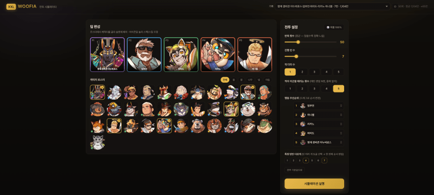
</div>

---

## 주요 기능

### 팀 편성

캐릭터 로스터에서 5인 파티를 구성합니다.
아이콘 우상단의 `X` 또는 로스터에서 다시 눌러 캐릭터를 제외할 수 있습니다.

<div align="center">
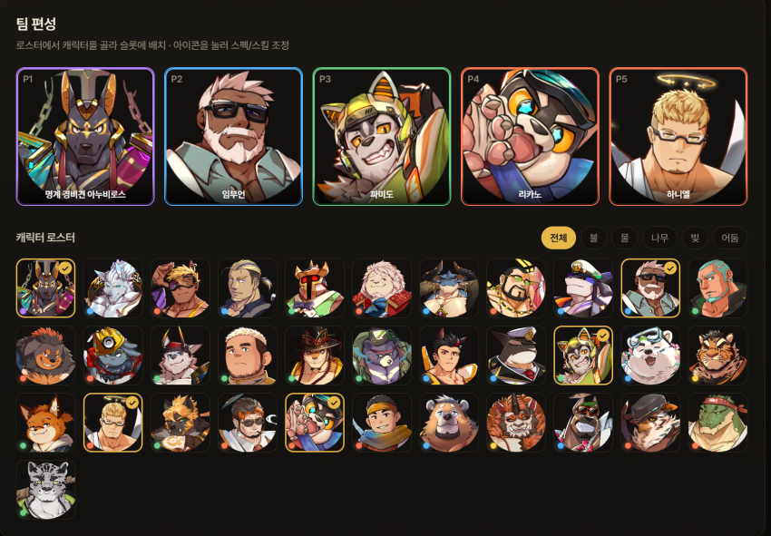
</div>

### 캐릭터 설정

각 캐릭터를 선택하면 상세 패널이 열립니다.

- **도장 강화** on/off 및 공격력·체력 배분 조절
- **스킬 레벨** 조절
- 보유 스킬 목록 및 **스킬 상세 효과** 확인

<div align="center">
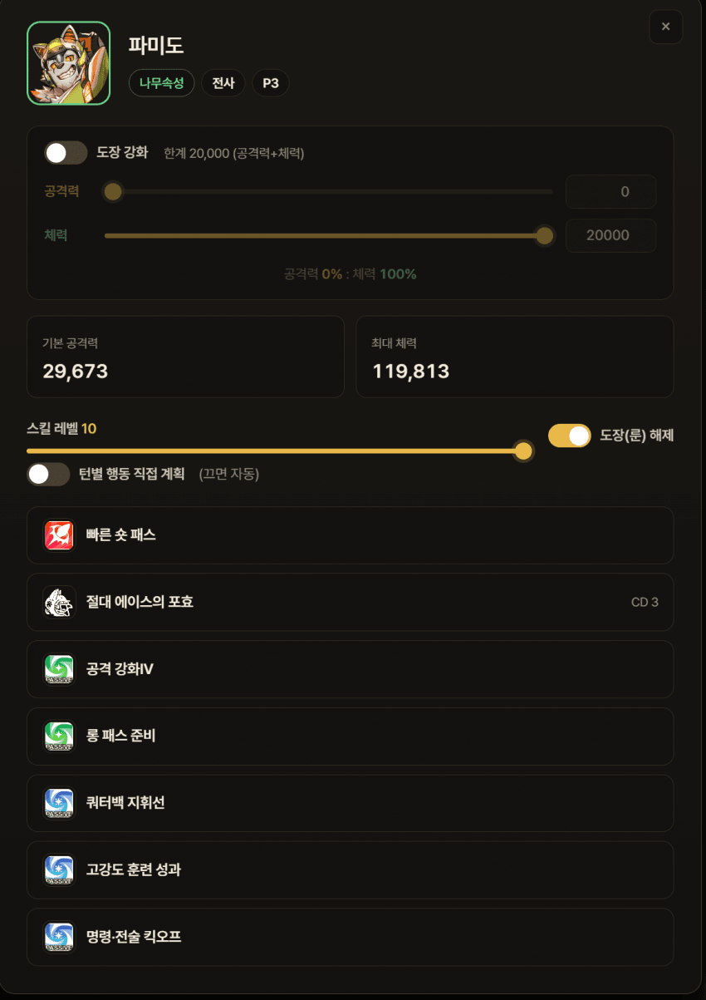
&nbsp;&nbsp;
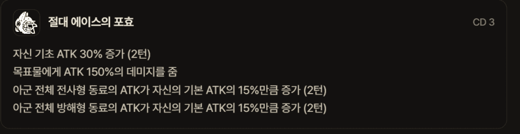
</div>

### 턴별 행동 계획

턴마다 캐릭터의 행동(평타 · 궁 · 방어)을 직접 지정할 수 있습니다.
끄면 자동으로 처리되며, 2회 행동 캐릭터 등 특수 케이스는 전용 설정으로 제공됩니다.

<div align="center">
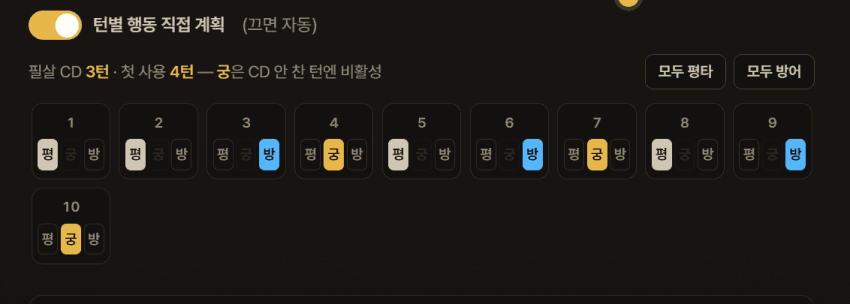
</div>

### 전투 설정

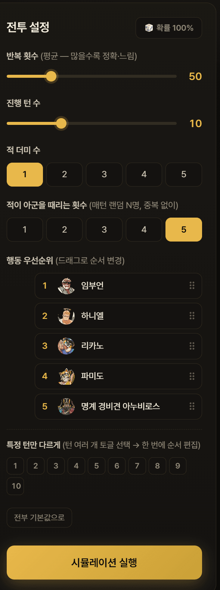

오른쪽 패널 하나에서 시뮬레이션 조건을 모두 설정합니다.

- **확률 100% 모드** — 모든 확률형 버프·공격을 무조건 발동시켜 계산
- **체력 10% 모드** — 딸피 구간 데미지 검증용 고정 체력 옵션
- **반복 횟수** — 평균·최소·최대값 산출 (값이 클수록 정확하지만 느림)
- **진행 턴 수** 조절
- **더미 속성** — 무·불·물·풀·빛·어둠 선택으로 상성(×1.5)·역상성(×0.75) 상황 확인 (무속성·무관 속성은 영향 없음)
- **적 더미 수** 지정
- **아군 피격 횟수** — `0`(아군을 타격하지 않음), `1~5`(적 N명이 개별 타격), `전체`(아군 전체 1회 동시 피격). 반격 횟수 등 결과가 달라집니다.

<br clear="right">

#### 속성 · 아군 피격 (상세)

<div align="center">
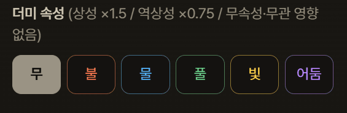
&nbsp;&nbsp;
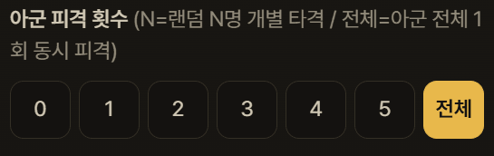
</div>

#### 행동 우선순위

같은 턴에 누가 먼저 움직이느냐에 따라 버프·연계 결과가 달라지므로, 행동 순서를 직접 지정할 수 있습니다.

- 기본적으로 파티의 행동 순서는 매 턴 동일하게 적용되며, 목록을 **드래그**해 순서를 바꿉니다.
- **특정 턴만 다르게** — 순서를 바꾸고 싶은 턴을 여러 개 토글로 선택한 뒤 한 번에 편집하면, 선택한 턴들에만 다른 순서가 일괄 적용됩니다. (예: 4·7·10턴만 별도 순서)
- **전부 기본값으로** 버튼으로 지정한 순서를 한 번에 초기화할 수 있습니다.

<div align="center">
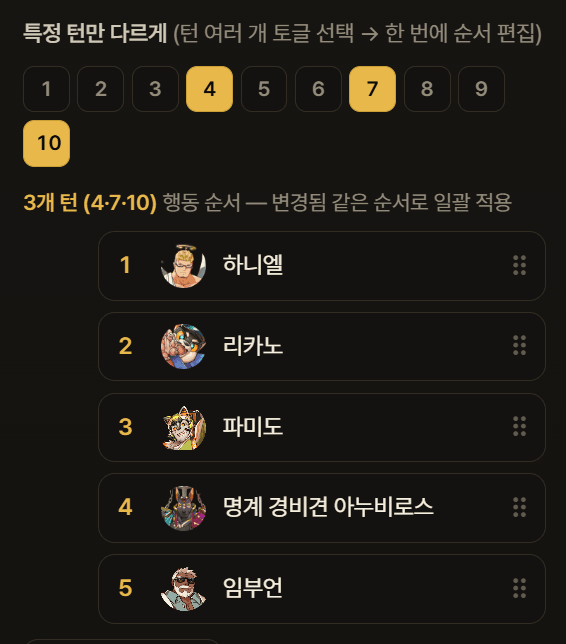
</div>

---

## 시뮬레이션 결과

### 통계 · 랭킹

총 데미지·DPS·턴 수와 함께 캐릭터별 기여도를 막대 랭킹으로 표시합니다. 각 수치는 중앙값·최소값·최대값을 함께 제공합니다.

<div align="center">
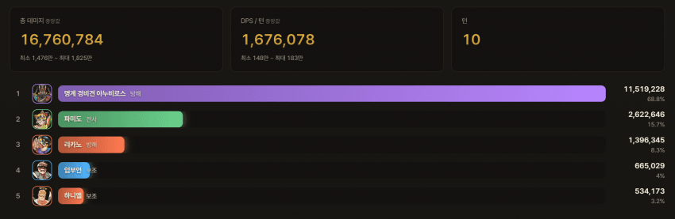
</div>

### 턴별 데미지 차트

턴별 데미지를 누적 막대로 표시하며, 그래프에 마우스를 올리면 해당 턴의 캐릭터별 수치가 나타납니다.

<div align="center">
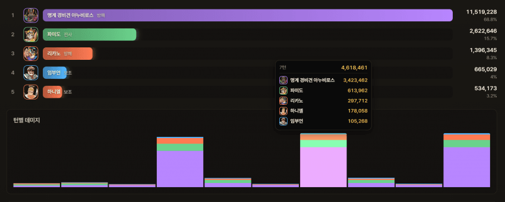
</div>

### 데미지 추적

데미지의 출처를 끝까지 추적합니다.

- 데미지 출처(스킬·반격·패시브) 명시 및 스킬 정보 연동
- 데미지 계산식 분해 (기초 ATK · 계수 · 고정값 · 상성 등)
- 버프 계수의 출처별 누적 내역까지 추적

<div align="center">
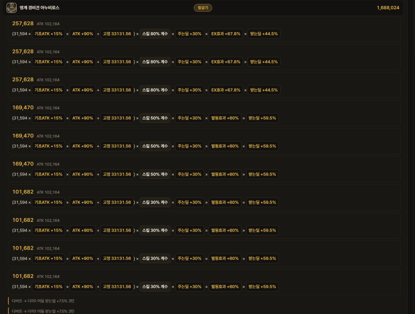
&nbsp;&nbsp;
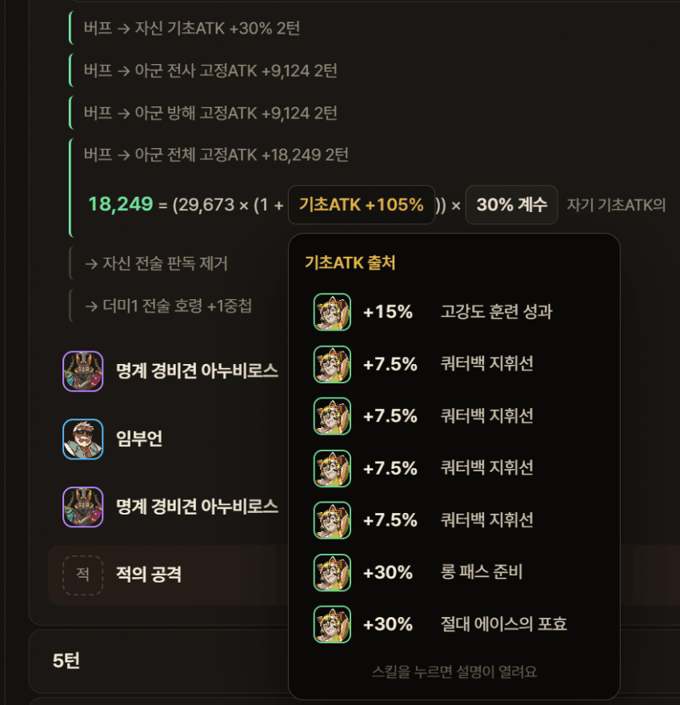
</div>

---

## 조합 비교하기

서로 다른 두 조합(또는 동일 조합의 변형)을 나란히 두고 턴별 누적 데미지를 비교합니다.

- 사이트 우측 하단(최근 업데이트 시간 위)의 버튼을 누르면 비교 창이 열립니다.
- **비교군 선택** — 기존 기록을 불러오거나, 추가 버튼으로 캐릭터를 하나씩 구성
- **턴 설정** — 비교군 중 가장 적은 턴에 맞춰 자동 정렬되며, 직접 수정 가능
- **캐릭터별 설정** — 교체 대상 선택, 도장 강화, 턴별 행동, 행동 우선순위를 비교군마다 따로 지정
- **그래프** — 두 조합의 누적 데미지 곡선을 함께 표시하고, 마우스를 올리면 턴별 차이(수치·%)를 보여줍니다.

<div align="center">
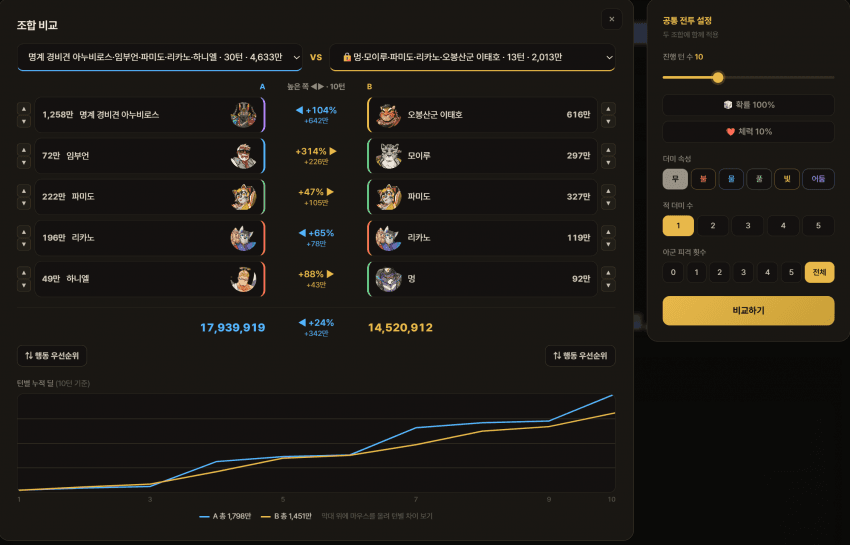
<br><br>
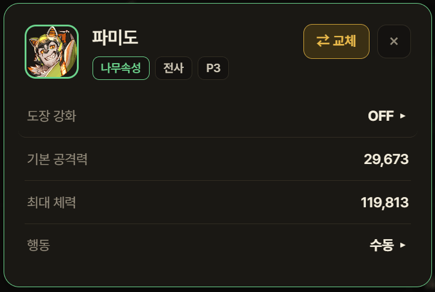
&nbsp;&nbsp;
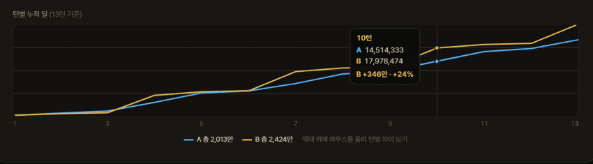
</div>

---

## 기록 시스템

시뮬레이션 결과는 자동으로 기록되며, 이름 검색·정렬로 다시 찾아볼 수 있습니다.

기록 항목의 점 3개 메뉴에서 **이름 변경 · 상단 고정 · 잠금 · 삭제**가 가능합니다.

**내보내기 / 가져오기** — 선택한 기록(복수 선택 가능)을 파일로 저장하거나 공유 코드로 복사할 수 있으며, 받은 코드를 가져오기에 붙여넣으면 그대로 불러옵니다.

<div align="center">
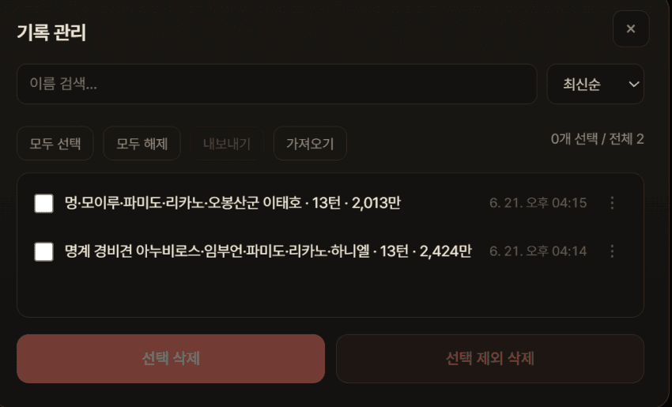
&nbsp;&nbsp;
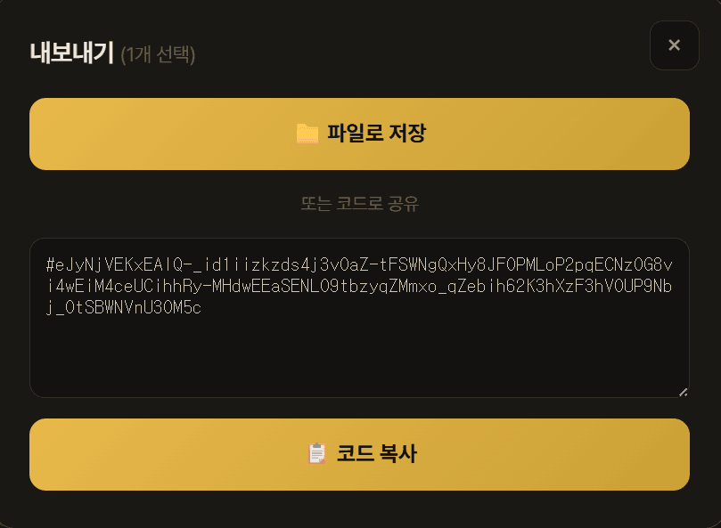
</div>

---

## 실행 방법

### 온라인 (GitHub Pages)

`main` 브랜치에 push하면 GitHub Actions가 자동으로 GitHub Pages에 배포합니다.
엔진(순수 Python)은 **Pyodide**로 사용자 브라우저 안에서 실행되므로 별도 서버가 필요 없습니다.

→ `https://<아이디>.github.io/<저장소이름>/`

### 로컬 실행 (개발용)

```
python server.py      # http://localhost:8777
```

로컬에서는 `server.py`(localhost:8777)가 API를 처리하고,
정적 호스팅(GitHub Pages)에서는 `dashboard/sim-worker.js`가 Pyodide로 같은 로직(`sim_api.py`)을 브라우저에서 실행합니다.

---

## 프로젝트 구조

- `woofia_sim/` — 시뮬레이션 엔진 (순수 Python 표준 라이브러리)
- `sim_api.py` — 캐릭터 메타 / 스킬 / 시뮬 API (`server.py`와 Pyodide가 공유)
- `server.py` — 로컬 개발 서버
- `dashboard/` — 프런트엔드 (index.html · app.js · style.css · sim-worker.js · icons)
- `data/` — 게임 데이터 (chars.json · skills.json)
- `.github/workflows/deploy.yml` — GitHub Pages 자동 배포

---

## 주의사항

- 모든 캐릭터의 검증이 완료된 것은 아니며, 일부 캐릭터의 패시브 처리에 오류가 있을 수 있습니다.
- 비교 기능을 포함한 일부 기능은 검증이 진행 중이므로 예상치 못한 동작이 있을 수 있습니다.
- 오류나 개선점을 발견하면 피드백 부탁드립니다.
